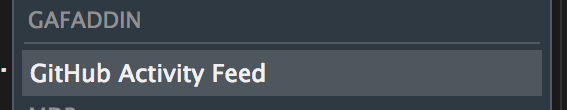
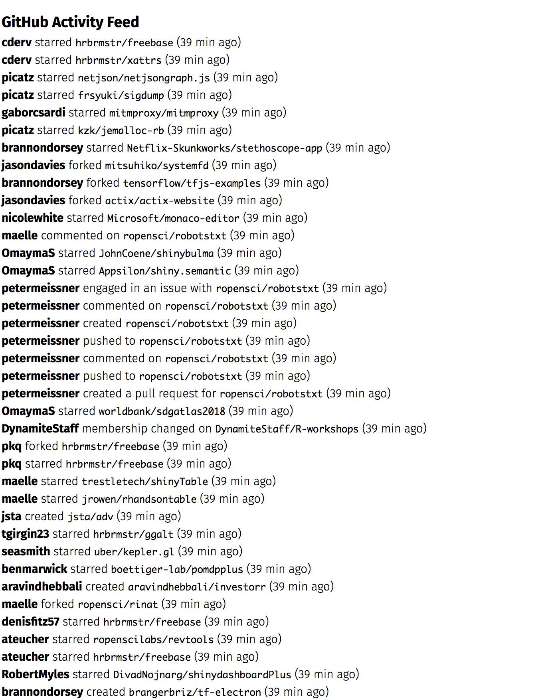

# gafaddin

GitHub Activity Feed RStudio Addin

## Description

Minimal HTML-view GitHub activity feed viewer.

## What’s Inside The Tin

An add-in for RStudio.

## Installation

``` r
devtools::install_github("hrbrmstr/gafaddin")
```

This uses the `gh` package so you need to have your environment
variables in order for this to work.

It also prefers Fira Sans.

Then go tothe ‘Addins’ menu and choose it.



Once you do you’ll get something like this:


